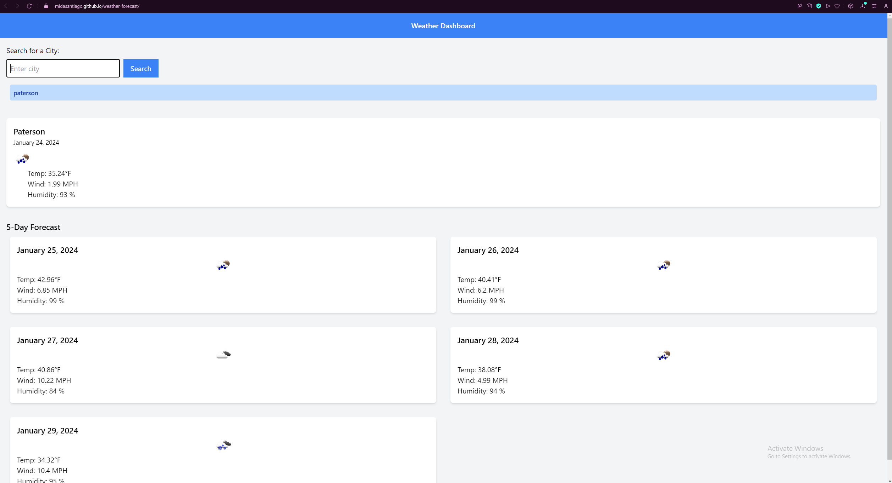

# Weather Dashboard
    
## Description
    
Get quick and up to date weather forecasts in your area or wherever want. View data including temperature, humidity, and wind speed. Plan your day with the handy weather dashboard

## ScreenShot

    
## Table of Contents
    
- [Installation](#installation)
- [Usage](#usage)
- [License](#license)
- [How to Contribute](#contributing)
- [Test](#test)
- [Questions](#questions)
    
## Installation
    
Just visit webpage
    
## Usage
    
Upon first loading into page, click on search bar and enter the desired city and click submit. The forecast will then be dsplayed. You can also click on any items in the history section to redo that search.
    
## License
    
MIT License
    
## Contributing
    
N/A
    
## Test
    
N/A
    
## Questions
    
My Github account is [GitHub.com/midasantiago](github.com/midasantiago)
    
If you wish to contact me you can do so at mida.santiago98@gmail.com
